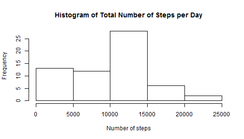
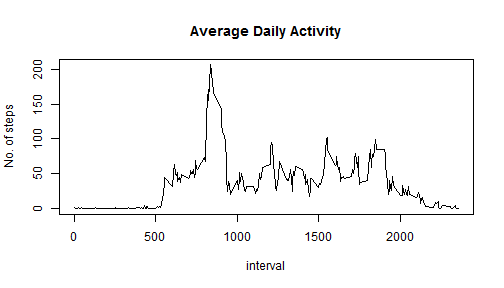
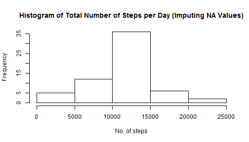
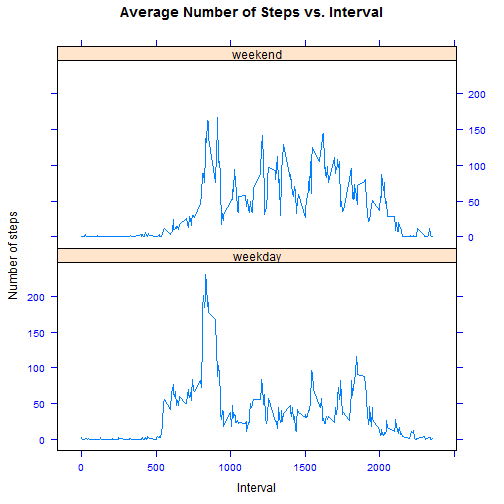

## Peer Assessment 1 - Reproducible Research"
#### *Author: tangbka*
#### *Date: Sunday, June 14, 2015*
</br>

We want to study the data generated by a personal activity monitoring device for an anonymous person to identify meaningful patterns or trends. The [data][1] comprised the number of steps taken at 5-minute intervals each day for the months of October and November 2012.

[1]:https://d396qusza40orc.cloudfront.net/repdata%2Fdata%2Factivity.zip

The variables in the dataset are:

1. **steps**: Number of steps taken in a 5-minute interval (missing values are coded as `NA`)  
2. **date**: The date on which the measurement was collected in the YYYY-MM-DD format  
3. **interval**: The identifier for the 5-minute interval in which the measurement was taken   
</br>

### A. Loading and preprocessing the data

First, I downloaded the dataset onto my computer and unzipped the file (activity.csv) onto my working directory for R. (There is no code for this.) This is followed by reading the data via _read.csv_. At the same time, I took the opportunity to load the *dplyr* package, which will be used extensively below. 


```r
dat <- read.csv("C:/Users/windy126/Documents/activity.csv")
if (require(dplyr)==F) install.packages("dplyr")
library(dplyr)
```
</br>
        
### B. What is mean total number of steps taken per day?

1. To calculate the total number of steps taken each day, the **dplyr** package was employed to group the data by date and then to sum the steps taken within each day.


```r
sum_steps <- dat %>% group_by(date) %>% summarise(sum(steps,na.rm=T))
names(sum_steps)[2] <- "steps"
print(sum_steps)
```

```
## Source: local data frame [61 x 2]
## 
##          date steps
## 1  2012-10-01     0
## 2  2012-10-02   126
## 3  2012-10-03 11352
## 4  2012-10-04 12116
## 5  2012-10-05 13294
## 6  2012-10-06 15420
## 7  2012-10-07 11015
## 8  2012-10-08     0
## 9  2012-10-09 12811
## 10 2012-10-10  9900
## ..        ...   ...
```

2. Plot the histogram of the total number of steps per day.

```r
hist(sum_steps$steps, main="Histogram of Total Number of Steps per Day", xlab="Number of steps")
```

 

3. The mean and median of the total number of steps taken per day are respectively

```r
as.numeric(summarise(sum_steps, mean(steps)))
```

```
## [1] 9354.23
```

```r
as.numeric(summarise(sum_steps, median(steps)))
```

```
## [1] 10395
```
</br>

### C. What is the average daily activity pattern?

1. To create the time series plot, it will be necessary to average the number of steps of each time interval across all 61 days.


```r
avg_step <- dat %>% group_by(interval) %>% summarise(average=mean(steps,na.rm=T))
with(avg_step, plot(interval, average, type="l", main="Average Daily Activity", ylab="No. of steps"))
```

 

2. The 5-minute interval on average across all days that registers the highest average number of steps is

```r
as.integer(avg_step[which(max(avg_step[,2]) == avg_step[,2]),1])
```

```
## [1] 835
```
</br>

### D. Imputing missing values  

1. The total number of missing values in the dataset is

```r
miss <- which(is.na(dat$steps))
length(miss)
```

```
## [1] 2304
```

2. All missing values will be replaced with the average of the 5-minute interval across all days.

3. The new dataset (known by the variable "newdata") is created by determining which row in the dataset has a missing value, and replacing it based on the 5-minute interval.


```r
newdata <- dat
for (i in miss) 
    newdata[i,1] <- avg_step[which(avg_step[,1] == newdata[i,3]),2]
head(newdata, n=15)
```

```
##        steps       date interval
## 1  1.7169811 2012-10-01        0
## 2  0.3396226 2012-10-01        5
## 3  0.1320755 2012-10-01       10
## 4  0.1509434 2012-10-01       15
## 5  0.0754717 2012-10-01       20
## 6  2.0943396 2012-10-01       25
## 7  0.5283019 2012-10-01       30
## 8  0.8679245 2012-10-01       35
## 9  0.0000000 2012-10-01       40
## 10 1.4716981 2012-10-01       45
## 11 0.3018868 2012-10-01       50
## 12 0.1320755 2012-10-01       55
## 13 0.3207547 2012-10-01      100
## 14 0.6792453 2012-10-01      105
## 15 0.1509434 2012-10-01      110
```

To check that we have replaced all missing values (i.e. `NA`), we look for missing values in the new dataset. We should get 0 missing values.

```r
which(is.na(newdata$steps))
```

```
## integer(0)
```

4. Using the __dplyr__ package, we recompute the total number of steps per day based on the new dataset and replot the histogram.

```r
sum_steps1 <- newdata %>% group_by(date) %>% summarise(sum(steps))
names(sum_steps1)[2] <- "steps"
hist(sum_steps1$steps, main="Histogram of Total Number of Steps per Day (Imputing NA Values)", xlab="No. of steps")
```

 

The mean and medians of the new dataset are respectively

```r
as.numeric(summarise(sum_steps1, mean(steps)))
```

```
## [1] 10766.19
```

```r
as.numeric(summarise(sum_steps1, median(steps)))
```

```
## [1] 10766.19
```
They are different than the ones calculated earlier, before imputing missing values. Not only have these two values increased, they are now of the same value.
</br>

### E. Are there differences in activity patterns between weekdays and weekends?

1. First, I converted the dates from the factor class to the date class. Then I check each one of them to see if it is a weekday or weekend, at the same time creating a new vector, which is added on as a new variable (4th column).


```r
wkday_set <- c("Monday", "Tuesday", "Wednesday", "Thursday", "Friday")  
day_vec <- vector()  
for (j in 1:nrow(newdata)) {
    x <- if (weekdays(as.Date(newdata[j,2])) %in% wkday_set) "weekday" else "weekend"
    day_vec[j] <- x
}
newdata$day <- day_vec
head(newdata, n=15)
```

```
##        steps       date interval     day
## 1  1.7169811 2012-10-01        0 weekday
## 2  0.3396226 2012-10-01        5 weekday
## 3  0.1320755 2012-10-01       10 weekday
## 4  0.1509434 2012-10-01       15 weekday
## 5  0.0754717 2012-10-01       20 weekday
## 6  2.0943396 2012-10-01       25 weekday
## 7  0.5283019 2012-10-01       30 weekday
## 8  0.8679245 2012-10-01       35 weekday
## 9  0.0000000 2012-10-01       40 weekday
## 10 1.4716981 2012-10-01       45 weekday
## 11 0.3018868 2012-10-01       50 weekday
## 12 0.1320755 2012-10-01       55 weekday
## 13 0.3207547 2012-10-01      100 weekday
## 14 0.6792453 2012-10-01      105 weekday
## 15 0.1509434 2012-10-01      110 weekday
```

2. To solve this question, first filter the data by weekend or weekday, group the data by the 5-minute interval, and then find the mean. 


```r
a <- newdata %>% filter(day=="weekend") %>% group_by(interval) %>% summarise(avg=mean(steps))
b <- newdata %>% filter(day=="weekday") %>% group_by(interval) %>% summarise(avg=mean(steps))
a$day <- rep("weekend", 288)
b$day <- rep("weekday", 288)
combined <- rbind(a, b)
```

Using the basic plotting system,

```r
library(lattice)
xyplot(avg~interval| factor(day), data=combined, scales=list(cex=.8, col="blue"), layout=c(1,2), type="l", xlab="Interval", ylab="Number of steps", main="Average Number of Steps vs. Interval")
```

 
